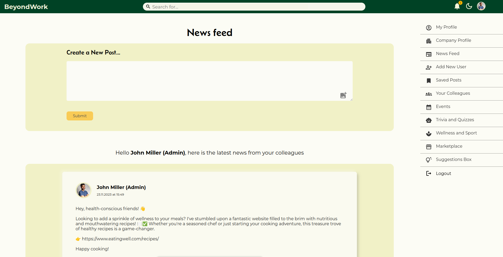

# [BeyondWork](https://beyondworkclient.onrender.com/)

BeyondWork is MERN stack group project, developed by four junior developers as a part of the Final Project of the DCI Further Training as a Web & Software Developer. 

Beyond Work is a platform for employees to connect on a personal level.

## Table of Contents

- [Introduction](#introduction)
- [Beyondwork Developers](#beyondwork-developers)
- [Features](#features)
- [Requirements](#requirements)
- [Usage](#usage)
- [Technologies Used](#technologies-used)
- [Project Structure](#project-structure)
- [Screenshot](#screenshot)

## Introduction

Beyond Work is a social network meant for employees in a company to interact on a personal level, create meaningful and deeper connections and share non-work related information and experiences.

Why do we need something like Beyond Work?
When thinking about the present company culture, we notice how many companies now work in a remote environment, or from different sites across the world. While this certainly has some great advantages, sometimes it can feel quite lonely and employees might miss the interpersonal relationships that are created on the workplace.

Moreover, it is scientifically proven that a more connected team makes stronger and more motivated workers.
On top of that, companies usually rely on mere chat tools for internal communication, meaning that some important information or attempts at more personal connection get lost in the hundreds of messages we receive every day.

Beyond Work, that looks and works more like a social media, is meant to fill the gap between employees and help them connect and bond.

# Beyondwork Developers
- Netta Barel - https://github.com/Netta8
- Elena Armaroli - https://github.com/elenarmaroli
- Iryna Khartanovich - https://github.com/statuja
- Marwah Al-Dujaili - https://github.com/Marwahaldujaili

## Features

- Company and Admin Registration and User creation
- Administrator role to add/remove users, manage the company profile
- Create edit, and delete posts.
- Create post with an image
- Like/unlike and save/unsave posts
- Edit profile with profile image and cover image
- View other employees and their profiles
- Responsive on different type of screens 
- Dark mode option
- Login Authentication and Authorization 

## Requirements

- Node.js
- MongoDB
- npm install
- To run client side: npm start
- To run server side: nodemon app.js / npm start

## Usage

- Run the development server: `npm run dev`
- Access the application at `http://localhost:3000`
- Find the deployed version [here](https://beyondworkclient.onrender.com/)

## Technologies Used

- MongoDB
- Express.js
- React.js
- Node.js
- Git & Github
- Postman
- npm 
- MUi
- SASS

## UI/UX Design & Task Management

- Figma
- Miro
- Trello
- Canva

## Project Structure

- `client/`: Contains the frontend React code.
- `server/`: Contains the backend Express.js code.

## Screenshot
Here, you can see the sleek and user-friendly interface of the Newsfeed once logged into BeyondWork. The function to create a post and add an image are easily accessible, providing a smooth and enjoyable user experience, together with the right-side menu displaying all the features and experiences offered by our platform. 

